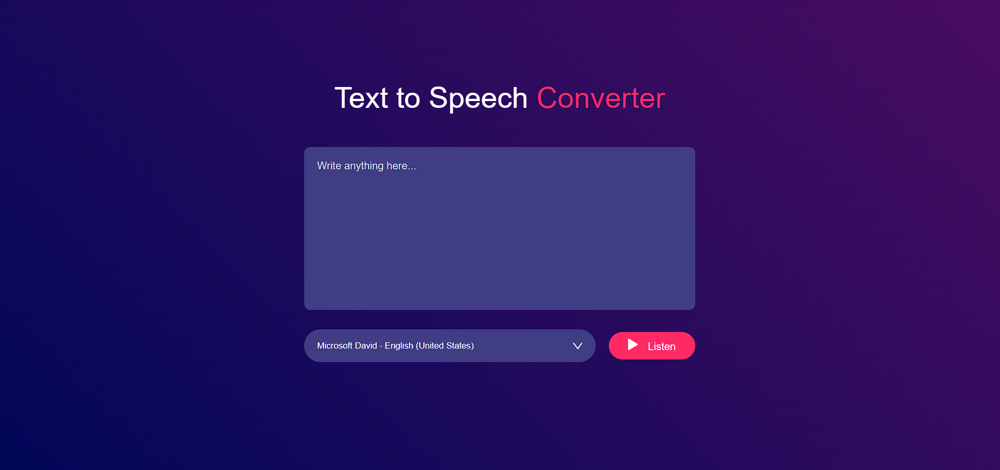

# 🎤 Text to Speech Converter

## 🚀 Overview
Transform your text into natural-sounding speech with this sleek and simple **Text to Speech Converter**! Designed with a clean interface and powered by the **Web Speech API**, this tool brings your words to life in just a click.

## ✨ Features
✅ **Instant Speech Output** – Type your text and hear it read aloud instantly.  
✅ **Multiple Voice Options** – Choose from various accents and languages.  
✅ **Modern & Responsive UI** – A stylish and intuitive design that works on all devices.  
✅ **No Installation Needed** – Just open the file in your browser and start converting text to speech!

## 🌐 Live Demo
Check out the deployed version of this project: [Text to Speech Converter](https://js-project-text-to-speech.vercel.app/)

## 🛠️ Technologies Used
🔹 **HTML** – Page structure  
🔹 **CSS** – Beautiful styling and layout  
🔹 **JavaScript** – Dynamic text-to-speech functionality using Web Speech API  

## 🎯 How to Use
1️⃣ **Download or Clone** this project.  
2️⃣ **Open** the `index.html` file in your favorite web browser.  
3️⃣ **Enter your text** into the provided text area.  
4️⃣ **Pick a voice** from the dropdown list.  
5️⃣ **Click 'Listen'** and enjoy your text being spoken aloud! 🎧  

## 📷 Screenshots
### Home Page


## 📂 Project Structure
```
/your-project-folder
│── index.html      # Main webpage
│── style.css       # Styling for the UI
│── script.js       # JavaScript functionality
└── images/         # Folder for UI assets
```

## 🌍 Browser Compatibility
This project works seamlessly on all modern browsers that support the **Web Speech API**, including:  
✔️ **Google Chrome**  
✔️ **Mozilla Firefox**  
✔️ **Microsoft Edge**  

## 👨‍💻 Author
🔹 **Aastha** ([GitHub](https://github.com/aastha-sin-09)) – Feel free to contribute and improve this project!

🚀 Enjoy converting your text into speech effortlessly! 🎙️

