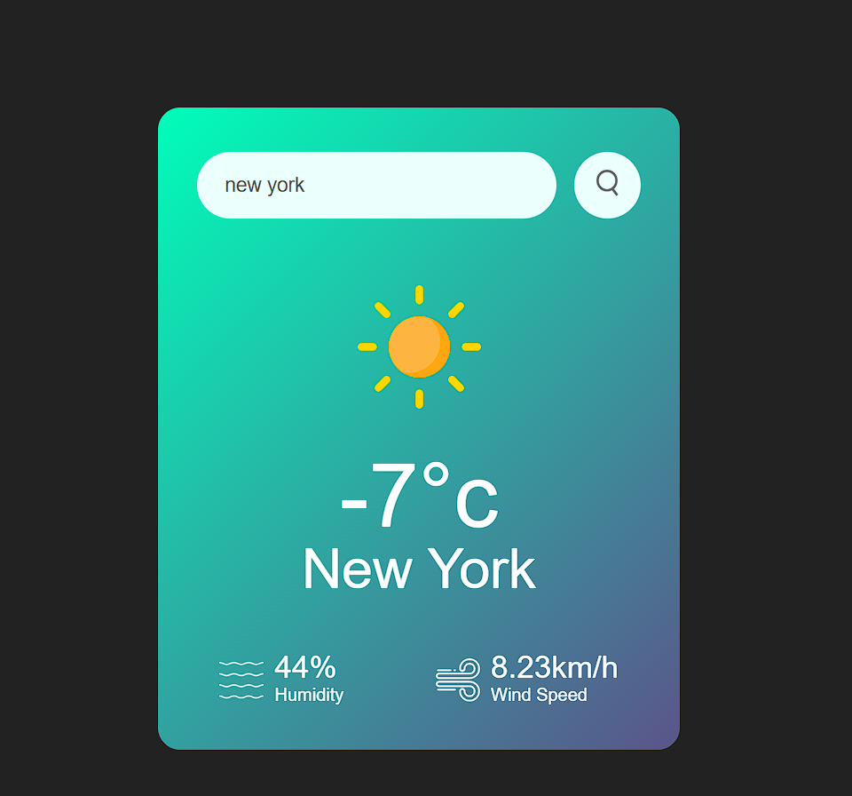

# 🌤️ Weather App

## 🌟 Overview
A simple and user-friendly weather application that fetches real-time weather data using the OpenWeatherMap API. Just enter a city name, and it will display the temperature, humidity, and wind speed, along with appropriate weather icons.

## 🚀 Features
- 🌍 Search for any city worldwide.
- 🌡️ Displays real-time temperature in Celsius.
- 💨 Shows wind speed and humidity levels.
- ☁️ Dynamic weather icons based on current conditions.
- ❌ Error handling for invalid city names.

## 🛠️ Technologies Used
- HTML5, CSS3
- JavaScript (Vanilla JS)
- OpenWeatherMap API

## 📸 Screenshots



## 🌐 Live Demo
Check out the live version of this project here: [Weather App on Vercel](https://js-project-weather-app.vercel.app/)

## 🎯 How to Use
1. Clone this repository:
   ```sh
   git clone https://github.com/aastha-sin-09/weather-app.git
   ```
2. Open `index.html` in your browser.
3. Enter a city name and press search to see the weather details.

## 🔧 Project Structure
```
📁 Weather-App
│── 📄 index.html  # Main HTML file
│── 📄 script.js   # JavaScript logic for API calls
│── 📄 style.css   # Styling file
│── 📁 images      # Weather icons and assets
```

## ⚙️ API Configuration
This project uses OpenWeatherMap API. If you want to use your own API key:
1. Sign up at [OpenWeatherMap](https://openweathermap.org/).
2. Replace the `apiKey` value in `script.js`:
   ```js
   const apiKey = "40b4265240516684e3a8d697f1aaade9";
   ```

## 🏗️ Future Improvements
- 📍 Geolocation support to fetch weather automatically.
- 🎨 Improved UI/UX.
- 📊 Additional weather details (sunrise/sunset, pressure, etc.).

## 🙌 Contributing
Feel free to submit issues and pull requests to improve this project.

💙 Happy Coding!

